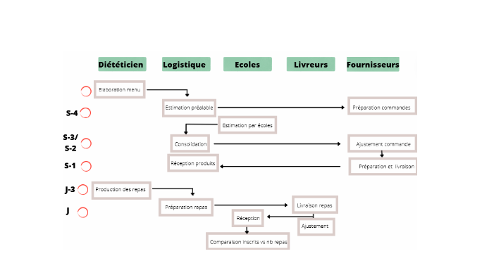

Projet : Prévision de la fréquentation des cantines scolaires nantaises
==============


## Présentation du projet

Le projet s'inscrit dans le cadre de ma formation de Développeuse IA avec l'organisme de formation Simplon. C'est un appel à projet de la métropole de Nantes.
Le projet est de réduire le gaspillage alimentaire des cantines scolaires nantaises tout en estimant la fréquentation 2 à 3 semaines à l'avance.


## Objectifs du Projet

L'objectif du projet est de prédire la fréquentation des cantines pour que les agents de restauration puissent transmettre leurs besoins, en nombre de repas, à la cuisine centrale et que cette dernière puisse l'anticiper correctement. Cette cuisine centrale livre tous les jours à environ 87 cantines scolaires sur la métropole nantaise. Ils ont pour objectif de réduire le gaspillage alimentaire sans faire de prévisions "trop-juste". En effet, il n'est pas acceptable que des élèves n'aient pas à manger le midi. Pour remplir cet objectif, ils ont récolté et constitué un dataset allant de 2011 à 2019 sous format .csv. Ce dataset est disponible sur leur site et contient des informations sur la date et la constitution du repas.



## Installation

Pour installer et exécuter ce projet sur votre machine locale, suivez les étapes suivantes :

1. Cloner ce dépôt :
   ```bash
   git clone https://github.com/votrenomdutilisateur/votre-nom-repo.git
   cd votre-nom-repo
    ```

2. Créer un environnement virtuel :
   ```bash
    python -m venv venv
    source venv/bin/activate  # Sur Windows utilisez `venv\Scripts\activate`
    ```

3. Installer les dépendances requises :
   ```bash
   pip install -r requirements.txt